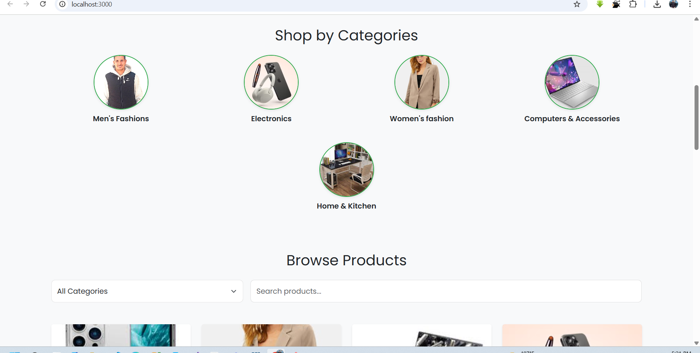
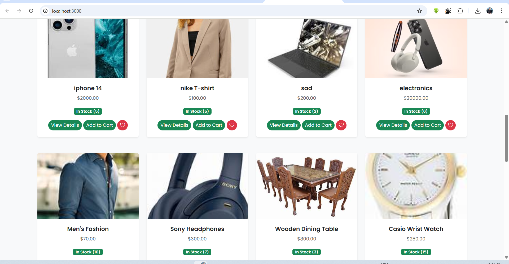
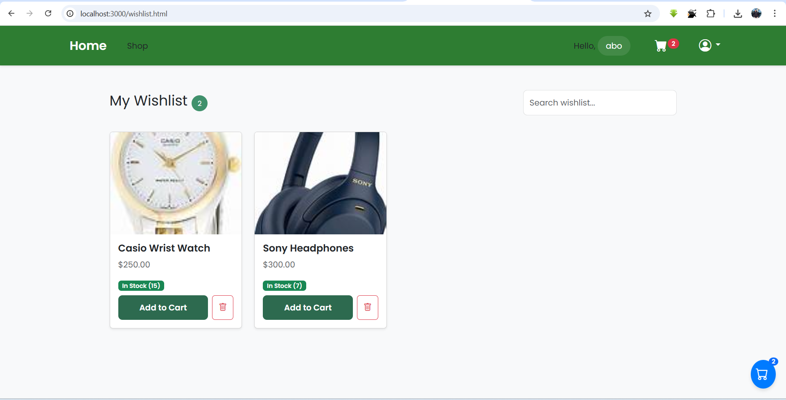
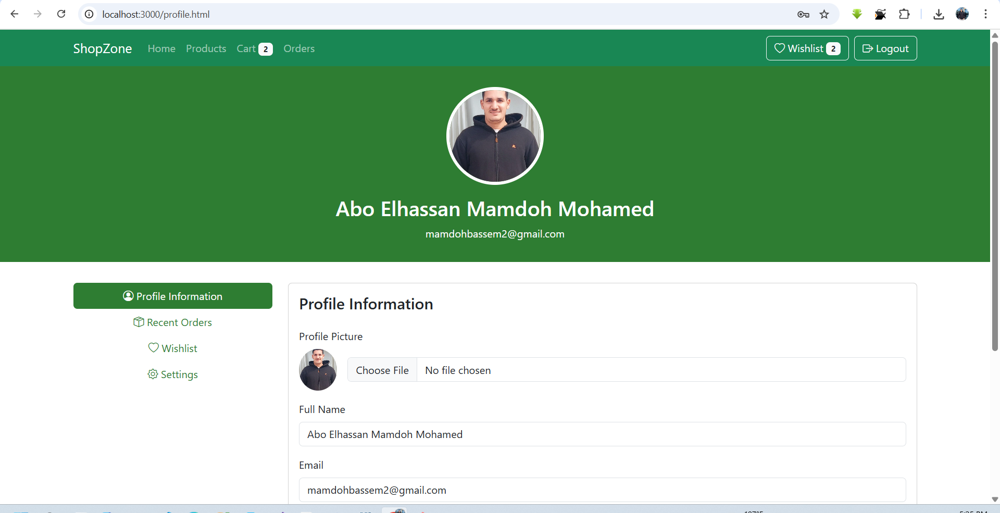
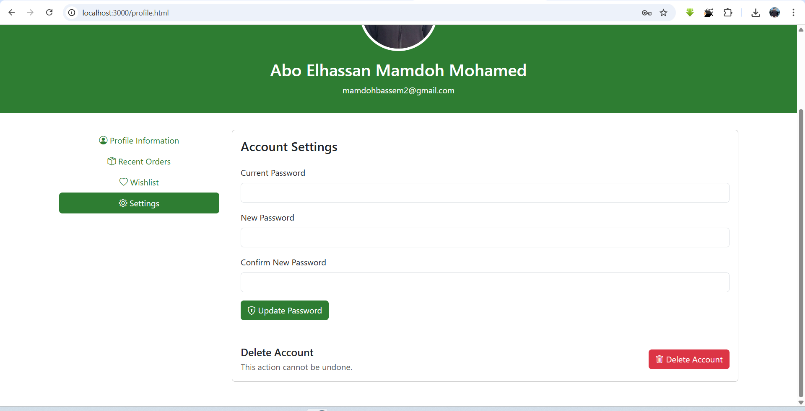
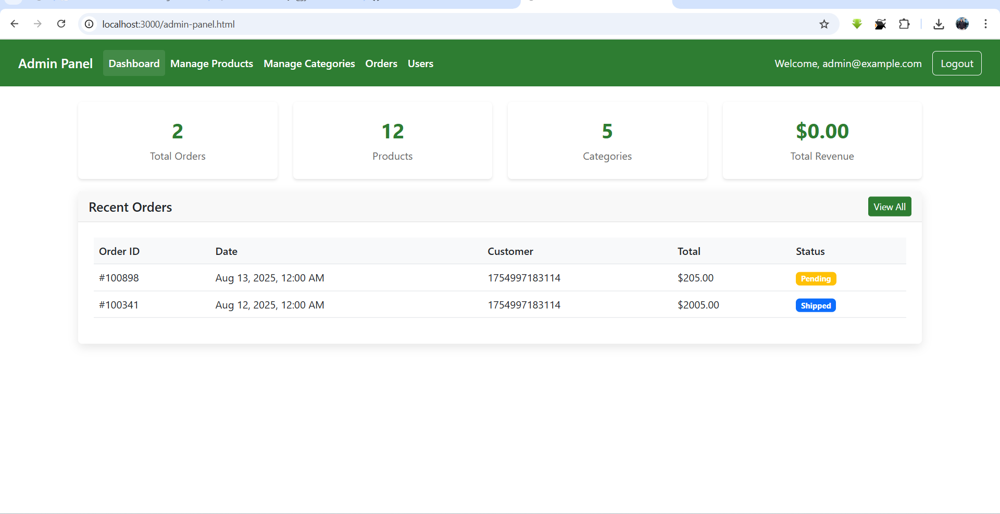
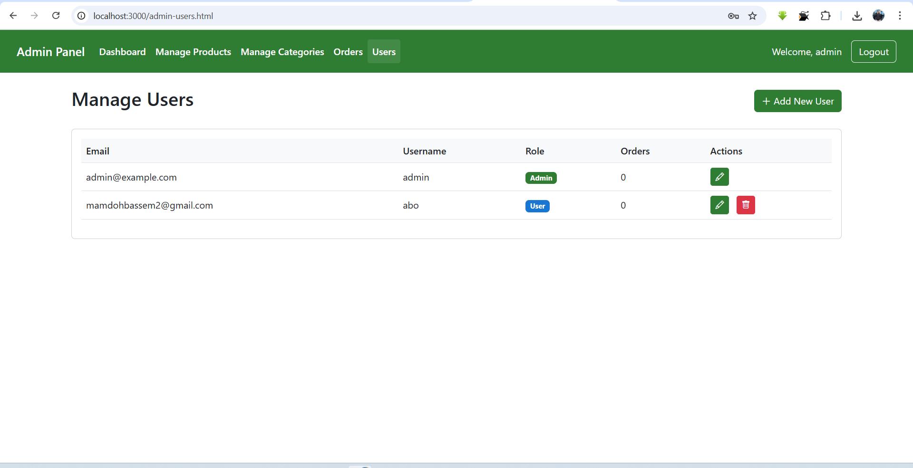
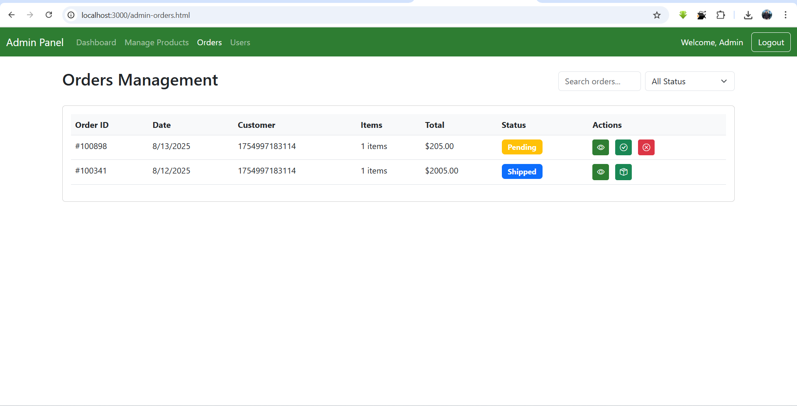
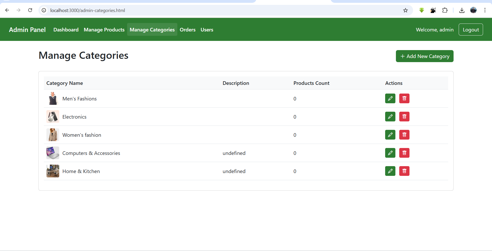
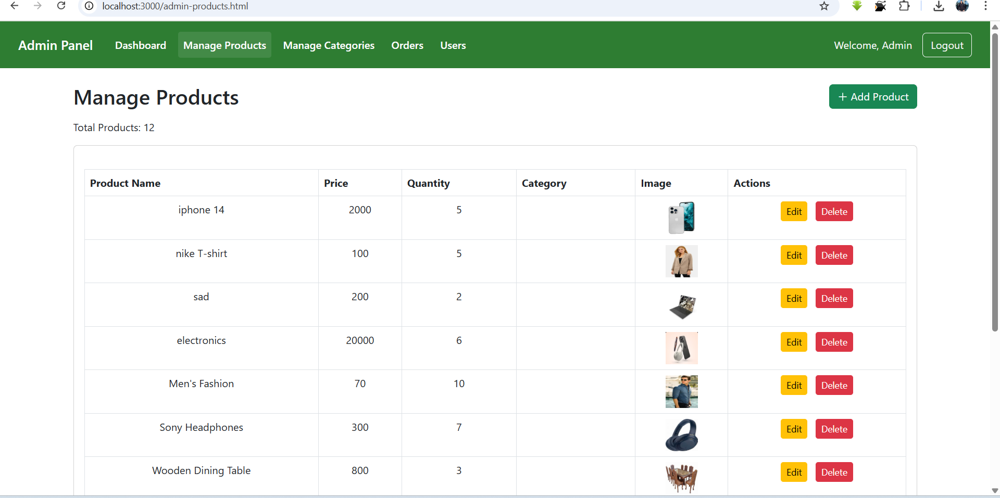

# 🛒 E-Commerce Project

## 📌 Overview
This is a **Full-Stack E-Commerce Application** built using **Node.js, Express, and Multer** with product & category management stored in a `data.json` file.  
It includes **Admin Dashboard** for CRUD operations and a **User Interface** for browsing products.

---

## 🚀 Features
- 📦 **Product Management** (Add, Edit, Delete, View)
- 📂 **Category Management** (Add, Edit, Delete, View)
- 🖼 **Image Uploads** using Multer
- 💾 **Data Storage** in `data.json`
- 🎨 **Responsive UI** with Bootstrap
- 🔍 Search and Filter products by category

---

## 🖼 Screenshots

### 🏠 Home Page


### 🏠 Home Page (Alternative View)


### 🏠 Home Page (Extended View)


### ❤️ Wishlist


### 👤 User Profile


### 📦 Profile Orders


### ⚙️ Account Settings


### 🛠 Admin Dashboard


### 👥 Manage Users


### 📦 Manage Orders


### 🏷 Manage Categories


### 🛒 Manage Products


---

## 🛠 Technologies Used
- **Frontend:** HTML, CSS, JavaScript, Bootstrap
- **Backend:** Node.js, Express.js
- **File Uploads:** Multer
- **Database:** JSON File (`data.json`)

---

## ⚙️ Installation
1. Clone the repository:
   ```bash
   git clone https://github.com/USERNAME/E-commerce-project.git

2. Navigate to the project folder:
    cd E-commerce-project
3. Install dependencies:
   npm install
4. Start the server:
   npm start
5. Open your browser and visit:
   http://localhost:3000

